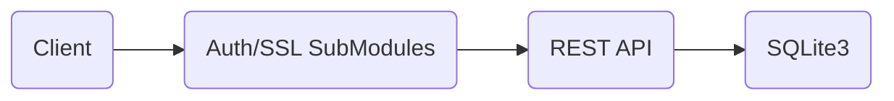

# Web Service Architecture
Python + Flask is been use to create the REST prototype and SQLite3 is been used to store the transaction.

The REST API has a very basic authentication useful to cover and test authentication scenarios. In addition, it has the support for SSL communication (Right now disabled)

We are storing all the information into a single table. The information could have been split into two tables: One for types and other for transactions, but since we don't have any extra requirements, it's better to use a single table to avoid inner joins and improve performances. 
| transaction_id | parent_id | type | amount |
|--|--|--|--|
| INTEGER PRIMARY KEY | INTEGER | VAR-CHAR(255) | DOUBLE

To connect to the data base we are using a singleton class because connecting to an external DB cost time, and it's better to maintain the connection open.

**Web service location**
 - The Rest Web service is located at *web_service* folder

**Installation**
 - Install python 2.7
 - Install pip or make it available in your PATH
 - pip install -r requirements.txt
 - Run the server
	 5. python server.py

**Server arguments**
 - Host: Used to specify host, defauls to 127.0.0.1
 - Port: In which port to run the API
 - d: If provided run server in debug mode

# Testing Framework